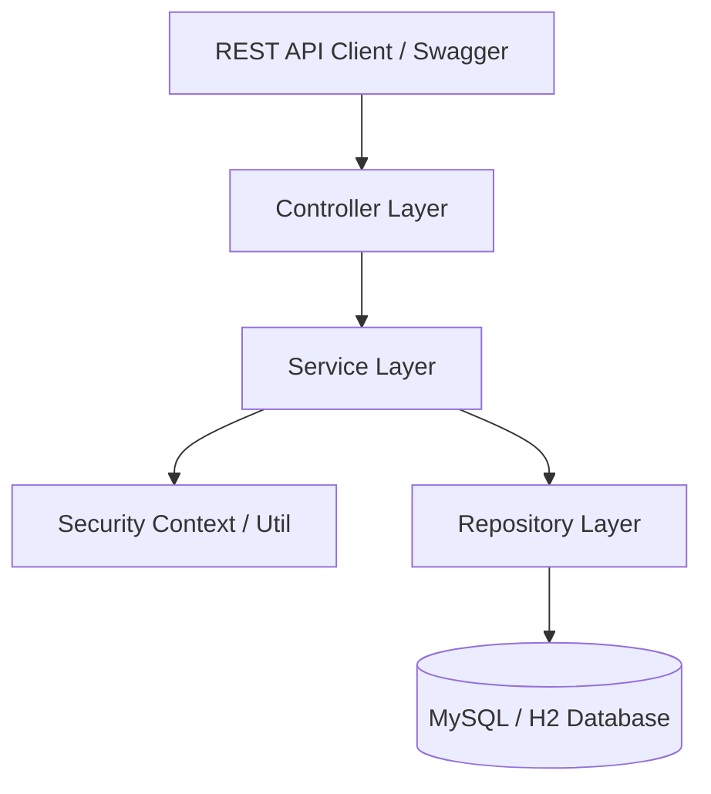
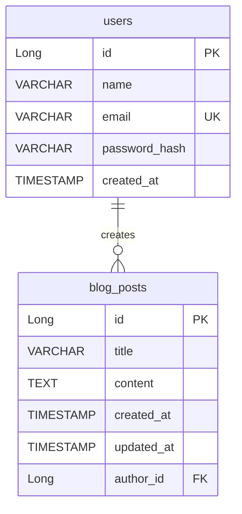
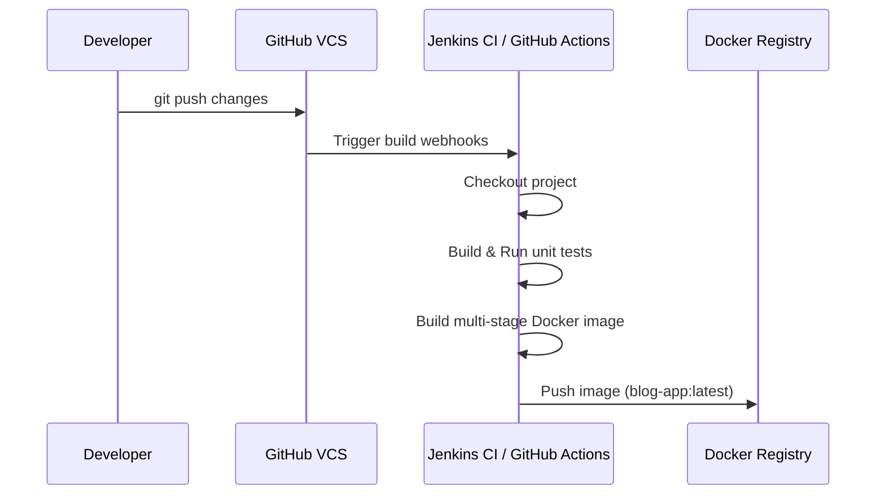

# Technical Design Document: Blog Management System

## 1. Problem Statement
Many blogging platforms require a robust, secure, and clean backend interface to handle user identity, post composition, modification, and access control. This project delivers a production-ready REST API-based blogging platform.

## 2. Goals
* Secure authentication using stateless JWT tokens.
* Role-based access control (RBAC) with `USER` and `ADMIN` roles.
* Full CRUD capabilities for Blog Posts with specific ownership and authorization checks:
  * Creating a blog post links it to the logged-in user.
  * Only the owner of a blog post can edit it.
  * The owner of a blog post or any `ADMIN` user can delete it.
* Eager data fetching using JOIN FETCH to avoid N+1 query problems.
* API discovery and testing capabilities using integrated Swagger UI/OpenAPI.
* Automatic data formatting, global error mappings, and validation.
* Dockerized multi-stage containerization.
* Health, readiness, and metrics monitoring using Spring Boot Actuator and Prometheus.

## 3. Non-Goals
* Development of a frontend user interface.
* Supporting social login integrations (e.g., OAuth2).
* Advanced blogging features such as comments, categories, tags, or search engine indexing in this initial version.

## 4. Technology Stack
* **Java 22**: Upgraded for execution optimization.
* **Spring Boot 3.3.1**: The core backend framework.
* **Spring Data JPA & Hibernate**: For database mapping and database interactions.
* **Spring Security & JJWT (0.12.5)**: To provide role-based authentication and secure token handling.
* **MySQL 8.0 / PostgreSQL / H2**: Relational databases supported for production and development/testing environments.
* **Springdoc OpenAPI 2.5.0**: For Swagger-based documentation.
* **Lombok**: For boilerplate-free class definitions.
* **JUnit 5 & Mockito**: For high-quality, comprehensive service testing.
* **Docker & Docker Compose**: For container orchestration.

## 5. System Architecture
The application follows an industry-standard layered architecture:

### Layer definitions:
1. **Controller Layer** (`controller/`): Exposes REST endpoints (`@RestController`).
2. **Service Layer** (`service/`): Contains `@Service` components and `@Transactional` boundaries.
3. **Repository Layer** (`repository/`): Database interaction layer extending `JpaRepository`.
4. **Entity Layer** (`entity/` / `model/`): JPA database entities.
5. **DTO Layer** (`dto/`): Data Transfer Objects for request/response serialization.
6. **Config Layer** (`config/`): Custom configuration classes (Security, Beans).

## 6. Entity Relationship Diagram (ERD)

### 6.2 Schema Definitions
#### users Table
* `id` (BIGINT, Primary Key, Auto-Increment)
* `name` (VARCHAR(255))
* `email` (VARCHAR(255), Unique, Indexed)
* `password_hash` (VARCHAR(500))
* `created_at` (TIMESTAMP)

#### blog_posts Table
* `id` (BIGINT, Primary Key, Auto-Increment)
* `title` (VARCHAR(255))
* `content` (TEXT)
* `created_at` (TIMESTAMP)
* `updated_at` (TIMESTAMP)
* `author_id` (BIGINT, Foreign Key referencing `users(id)`)

---

## 7. API Interface Definitions

### Auth Endpoints
* `POST /api/v1/auth/register`
  * Registers a new user. Returns a signed JWT token.
* `POST /api/v1/auth/login`
  * Validates email/password and returns a JWT token.

### Blog Endpoints
* `GET /api/v1/blogs`
  * Retrieves all blog posts. Public access.
* `GET /api/v1/blogs/{id}`
  * Retrieves a single blog post by ID. Public access.
* `POST /api/v1/blogs` (Create Resource Endpoint)
  * Creates a new blog post. Requires JWT.
  * Success response: `201 Created`
  * Error response: `400 Bad Request`
* `PUT /api/v1/blogs/{id}`
  * Updates a blog post. Only accessible to the owner. Requires JWT.
* `DELETE /api/v1/blogs/{id}`
  * Deletes a blog post. Accessible to the owner or an ADMIN. Requires JWT.

---

## 8. Cross-Cutting Concerns

### 8.1 Security & Authentication
* **Protected Endpoints**: A stateless JWT verification filter (`JwtAuthenticationFilter`) intercepting requests, parsing Bearer tokens in the `Authorization` header, and populating the `SecurityContext`.
* **Role Constraints**: 
  * Admin endpoints prefixed with `/api/v1/admin/**` are strictly restricted to role `ROLE_ADMIN` (e.g. `.requestMatchers("/api/v1/admin/**").hasRole("ADMIN")`).
  * Password encryption uses the robust `BCryptPasswordEncoder` hashing algorithm.

### 8.2 Profiles & Application Properties
* **application.yml**: Shared configurations (active profiles, JWT keys).
* **application-dev.yml**: Local development configurations pointing to H2 database parameters or local PostgreSQL parameters.
* **application-prod.yml**: Production configuration variables importing credentials securely using environment variables (`${DB_HOST}`, `${DB_USERNAME}`, etc.).

### 8.3 Logging & Monitoring
* **Logging Framework**: Structured SLF4J backed by Logback (`logback-spring.xml`) configured to roll daily log files to the console and to `./logs/blog-management.log`.
* **Metrics**: Integrated `Spring Boot Actuator` combined with `Micrometer Prometheus` exporting active application statistics to scrape path `/actuator/prometheus`.

---

## 9. Deployment & CI/CD Pipeline

### 9.1 Containerization
Multi-stage build Dockerfile minimizing the container size:
1. **Build Stage**: Maven image running compiler target JDK 22.
2. **Runtime Stage**: Eclipse Temurin JDK 22 JRE Jammy image running the packaged application.

### 9.2 CI/CD Sequence
The build pipeline compiles, runs tests, creates Docker packages, and publishes them:

